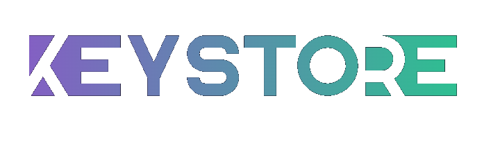

<h1 align="center">
  <a href="https://github.com/gotunixcode/keystore">
    <!-- Please provide path to your logo here -->
    
  </a>
</h1>

  Keystore
   

## Authors & contributors

The original setup of this repository is by [Justin Ovens](https://github.com/gotunixcode).

